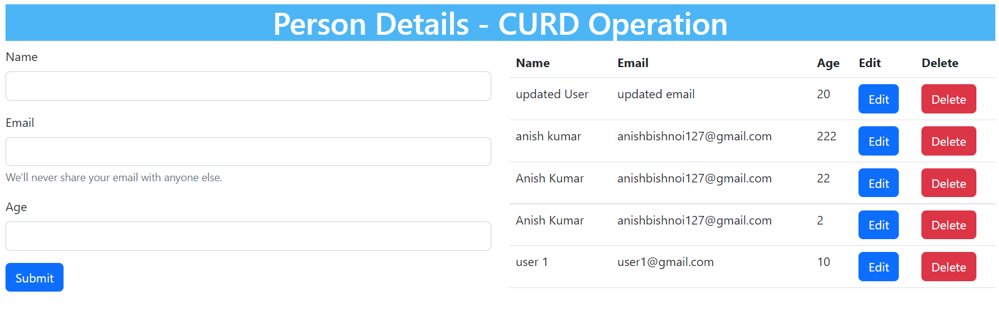

#### HOSTED API LINK 
[API URL :- ](https://curd-mern-agbf.vercel.app/)
https://curd-mern-agbf.vercel.app/   // api hosted.

**GET ALL USER** **:-**  https://curd-mern-agbf.vercel.app//api/v1/users

**CREATE USER** **:-** https://curd-mern-agbf.vercel.app/api/v1/users

**GET SINGLE USER :-** https://curd-mern-agbf.vercel.app/api/v1/users/single/634f04d54b08a01217883301

**UPDATE USER :-** https://curd-mern-agbf.vercel.app/api/v1/users/634f04d54b08a01217883301

**DELETE USER :-** https://curd-mern-agbf.vercel.app/api/v1/users/634f04e64b08a0121788330a

#### HOSTED FRONT END LINK
[FRONT END LINK :- ](https://curd-mern-app.vercel.app/)
https://curd-mern-app.vercel.app/  // front end hosted.

### Preview Front UI

#### Home Page UI

#### Update Page UI

## Featues:

- CREATE USER
- UPDATE / EDIT USER
- GET ALL USER DETAILS
- GET SINGLE USER DETAILS
- DELETE USER 